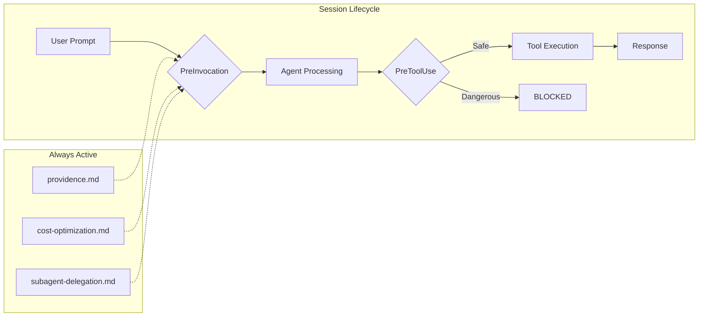

# 🎯 AI Steering Rules

[](LICENSE)
[](#rules)
[](#skills)
[](#review-protocols)
[](#quick-start)

> **7,015+** steps analyzed · **~65%** token savings · **80%** fewer false positives · **5** review modes · **6** prongs

Battle-tested governance rules for AI coding assistants — forged from 17 real sessions and enforced via lifecycle hooks.

## Quick Start

> **Prerequisites:** `git`, `make`, and one of: [Gemini/Antigravity](https://github.com/google-gemini/antigravity), [Kiro](https://kiro.dev), or [GitHub Copilot](https://github.com/features/copilot)

```bash
git clone https://github.com/nseney1/ai-steering-rules.git
cd ai-steering-rules
cp steering.conf.example steering.conf   # Optional: customize for your team
make install                              # Gemini / Antigravity (default)
# make install-kiro                       # Kiro alternative
# make install-copilot                    # GitHub Copilot alternative
```

Rules take effect on your next conversation turn. No restart needed.

## How It Works



**Text fallback:** Every user prompt passes through a PreInvocation hook that injects always-on governance rules. Each tool call is screened by a PreToolUse safety gate — dangerous operations (e.g., `rm -rf /`, `git push -f`) are blocked automatically.

## 📜 Rules

| Rule | Trigger | Purpose |
|:-----|:--------|:--------|
| [providence.md](rules/providence.md) | always_on | **Highest priority.** Codebase grounding, claim verification, no hallucinations, diagnose-before-repair. |
| [cost-optimization.md](rules/cost-optimization.md) | always_on | Token efficiency, diffs-only edits, model tiering, FPSR metric (>80%). |
| [subagent-delegation.md](rules/subagent-delegation.md) | always_on | Context protection, concurrency limits (4 readers / 3 writers), delegation floor. |
| [architectural-tenets.md](rules/architectural-tenets.md) | model_decision | Pragmatism, trade-off analysis, scale-to-zero. |
| [polyglot-standards.md](rules/polyglot-standards.md) | model_decision | Unified entrypoints (Makefiles), containerization. |
| [feature-specs.md](rules/feature-specs.md) | model_decision | PRD structure, acceptance criteria, documentation. |
| [testing.md](rules/testing.md) | model_decision | Behavioral testing, sad paths, ast.parse ban. |
| [documentation.md](rules/documentation.md) | model_decision | ADRs, actionable READMEs, Mermaid diagrams. |
| [destructive-ops.md](rules/destructive-ops.md) | model_decision | Dry-run mandates for IaC, database mutations, bulk git. |
| [git-workflow.md](rules/git-workflow.md) | model_decision | Conventional commits, .gitignore verification, pre-push test gate. |
| [desktop-automation.md](rules/desktop-automation.md) | model_decision | PyAutoGUI/xdotool safety: focus verification, coordinate clamping. |

> [!TIP]
> `always_on` rules load every turn (~3,750 tokens). `model_decision` rules load full content only when relevant (~30 tokens idle). See [METRICS.md](docs/METRICS.md) for per-file token costs.

## 🧠 Skills

| Skill | Purpose |
|:------|:--------|
| [adaptive-reviewer](skills/adaptive-reviewer/SKILL.md) | 🔬 Auto-escalating review orchestrator with subagent nesting (E11 — TESTING). |
| [code-review](skills/code-review/SKILL.md) | Staff Engineer: architectural flaws, race conditions, SOLID violations. |
| [domain-researcher](skills/domain-researcher/SKILL.md) | Compiles verified external facts (wikis, API docs, papers). |
| [governance-auditor](skills/governance-auditor/SKILL.md) | Mechanical per-rule PASS/FAIL compliance checks. |
| [incident-debug](skills/incident-debug/SKILL.md) | SRE: reproduce → isolate → diagnose → fix → verify. |
| [performance-audit](skills/performance-audit/SKILL.md) | Hot-path allocations, O(n²) patterns, GC pressure. |
| [post-mortem](skills/post-mortem/SKILL.md) | Blameless retrospective analysis, pattern extraction. |
| [readme-writer](skills/readme-writer/SKILL.md) | Scannable, copy-pasteable developer READMEs. |
| [refactoring-pilot](skills/refactoring-pilot/SKILL.md) | Mikado Method, incremental moves across 4+ files. |
| [security-audit](skills/security-audit/SKILL.md) | AppSec Engineer: OWASP Top 10, hardcoded secrets. |
| [session-monitor](skills/session-monitor/SKILL.md) | Live waste trajectory tracking, periodic probes. |
| [session-preflight](skills/session-preflight/SKILL.md) | Pre-flight: venv health, git state, test suite verification. |
| [spec-synthesizer](skills/spec-synthesizer/SKILL.md) | Cross-references multi-lens findings into prioritized plans. |
| [staff-review](skills/staff-review/SKILL.md) | Multi-lens fan-out (10 lenses) with staff-level synthesis. |
| [visual-analyst](skills/visual-analyst/SKILL.md) | Screen & UI analysis: game state, coordinates, regressions. |

## 🔍 Review Protocols

| Mode | Dispatches | Cost | Best For |
|:-----|:----------:|:----:|:---------|
| 🌱 Breeze | 2 | ~3-4k | Known bugs, renames |
| 🌬️ Gale | 3-4 | ~4k | Quick reviews |
| 🔱 Trident | 5-8 | ~8-12k | Features, refactors |
| 🌊 Maelstrom | 7-12 | ~15-20k | Architecture, security |
| ⛈️ Tempest | 8-12 | ~30-50k | Catastrophic risk |

> [!NOTE]
> Reviews use 6 prongs: 🍄 Spores (width), 🍄 Mycelium (blast radius), 🌿 Roots (depth), 🌹 Thorns (adversarial), 🪨 Bedrock (verification gate), 🍂 Mulch (learning). See [staff-review SKILL.md](skills/staff-review/SKILL.md) for full prong details and escalation paths.

## Configuration

Copy [`steering.conf.example`](steering.conf.example) → `steering.conf` to customize platform, team size, git strategy, and approval chains.

```bash
make info     # Show current configuration
make doctor   # Verify installation health
```

> [!IMPORTANT]
> Run `make doctor` after installation to verify symlinks, hook registration, and rule loading.

<details>
<summary>Advanced Installation</summary>

### Symlink Method (Gemini)

```bash
ln -sf "$(pwd)/rules" ~/.gemini/config/rules
ln -sf "$(pwd)/skills" ~/.gemini/config/skills
```

### Kiro

```bash
make install-kiro
```

Activate manual rules by typing `#testing`, `#documentation`, `#feature-specs`, etc.

### GitHub Copilot

```bash
make install-copilot MODE=global    # Merges all rules into ~/copilot-instructions.md
make install-copilot MODE=project   # Creates .github/instructions/*.instructions.md
```

Ensure "Enable custom instructions" is checked in your IDE's Copilot settings.

</details>

## Deep Dives

| Document | Contents |
|:---------|:---------|
| [Metrics & Token Economics](docs/METRICS.md) | Per-file token costs, compliance scores, waste analysis, ROI calculations |
| [Evolution](docs/EVOLUTION.md) | How the approach evolved across 10 phases, from prescriptive to autonomous orchestration |
| [Experiments](docs/EXPERIMENTS.md) | A/B testing framework (E1–E17) for data-driven governance evolution |

## License

MIT
