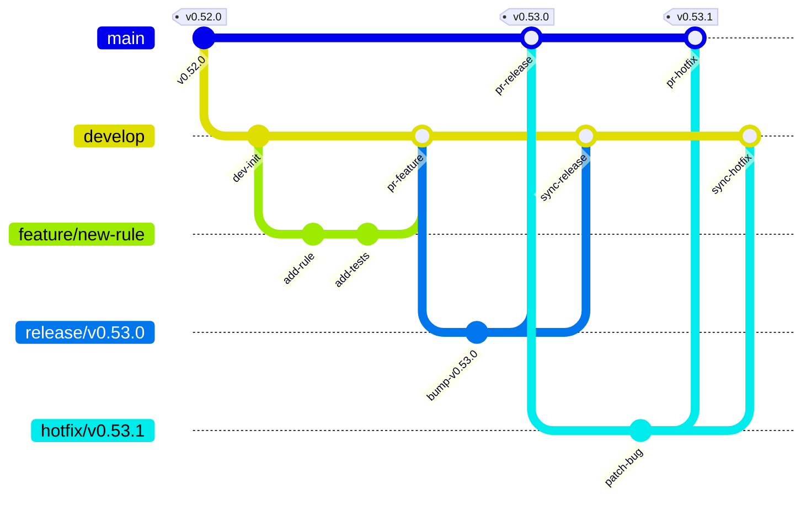

# Git Branching Model (Gitflow)

This document defines the Gitflow branching strategy, lifecycle rules, and release protocols for Soma.

---

## Branching Model

| Branch | Purpose | Merges Into | Protected? |
|:-------|:--------|:------------|:-----------|
| `main` | Production releases only | — | Yes |
| `develop` | Integration branch | `release/*` → `main` | Yes |
| `feature/*` | New features | `develop` | No |
| `fix/*` | Bug fixes | `develop` | No |
| `release/*` | Release candidates | `main` + back to `develop` | No |
| `hotfix/*` | Emergency prod fixes | `main` + back to `develop` | No |

---

## Workflow Diagram



---

## Rules

1. **No direct pushes to protected branches**: Never push directly to `main` or `develop` — all changes must arrive via pull request.
2. **Feature & bugfix lineage**: `feature/*` and `fix/*` branches branch from `develop` and PR back to `develop`.
3. **Release preparation**: `release/*` branches cut from `develop` — bump version strings, perform final testing and verification, then PR to `main`.
4. **Production tagging**: Tag releases on `main` immediately following merge: `v0.53.0`, `v0.53.1`, etc.
5. **Sync release back to develop**: After tagging `main`, merge the `release/*` branch back to `develop` to ensure integration parity.
6. **Hotfix lifecycle**: Hotfixes branch directly from `main`, PR to `main`, get tagged, and are then merged (or cherry-picked) back into `develop`.
7. **Review delegation**: PRs to `develop` are reviewed by AI audit subagents and merged autonomously. PRs to `main` (release/hotfix) require human review and approval. This keeps the human focused on ship decisions, not incremental review.

---

## Release Checklist

1. Create `release/vX.Y.Z` from `develop`:
   ```bash
   git checkout develop && git pull origin develop
   git checkout -b release/vX.Y.Z
   ```
2. Bump version in `pyproject.toml` and `VERSION`.
3. Update [CHANGELOG.md](file:///home/nseney/Documents/soma/docs/CHANGELOG.md).
4. Run full test suite:
   ```bash
   make test
   make validate
   ```
5. PR `release/vX.Y.Z` to `main`, get CI green.
6. Merge PR and tag `vX.Y.Z` on `main`:
   ```bash
   git checkout main && git pull origin main
   git tag -a vX.Y.Z -m "Release vX.Y.Z"
   git push origin vX.Y.Z
   ```
7. Merge release branch back to `develop`:
   ```bash
   git checkout develop && git pull origin develop
   git merge --no-ff release/vX.Y.Z
   git push origin develop
   ```
8. Delete release branch:
   ```bash
   git branch -d release/vX.Y.Z
   git push origin --delete release/vX.Y.Z
   ```

---

## Hotfix Checklist

1. Create `hotfix/vX.Y.Z` from `main`:
   ```bash
   git checkout main && git pull origin main
   git checkout -b hotfix/vX.Y.Z
   ```
2. Fix the bug, bump patch version in `pyproject.toml` and `VERSION`, and update [CHANGELOG.md](file:///home/nseney/Documents/soma/docs/CHANGELOG.md).
3. PR `hotfix/vX.Y.Z` to `main`, get CI green.
4. Merge PR and tag `vX.Y.Z` on `main`:
   ```bash
   git checkout main && git pull origin main
   git tag -a vX.Y.Z -m "Hotfix vX.Y.Z"
   git push origin vX.Y.Z
   ```
5. Cherry-pick or merge hotfix to `develop`:
   ```bash
   git checkout develop && git pull origin develop
   git merge --no-ff hotfix/vX.Y.Z
   git push origin develop
   ```
6. Delete hotfix branch:
   ```bash
   git branch -d hotfix/vX.Y.Z
   git push origin --delete hotfix/vX.Y.Z
   ```
